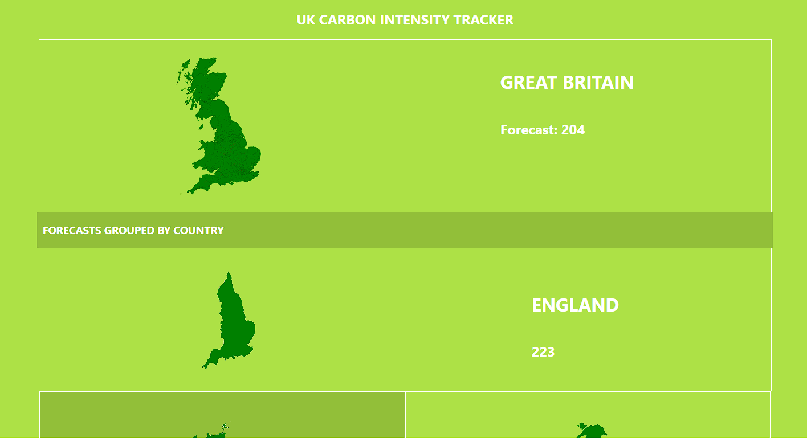
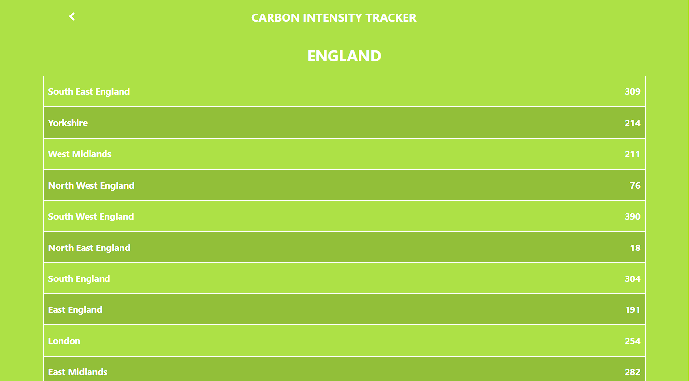

# Great Britain Carbon Intensity Tracier

> In this project I use React, JSX, and Redux to design a single-page application that allows users to view the carbon intensity forecast of different areas within Great Britain.




## Built With

- React JS
- Redux
- HTML
- CSS

## Live Demo

To view a live demo on Netlify, click [here](https://adoring-pasteur-94aa51.netlify.app/).

## Getting Started

### Prerequisites

- Install a code editor(VSCode or Atom will do the trick)
- Install NodeJS
- Install Git Bash

### Setup

- In a folder of your choice, clone this repo using ```git clone https://github.com/YuvrajM108/carbon-intensity-app-capstone.git``` in your git bash.
- ```cd carbon-intensity-app-capstone``` and then ```code .``` or ```atom .``` depending on your editor to open the project

### Install

- In your integrated command line, ```yarn``` to install all node dependencies

### Usage

- In your integrated command line, ```yarn start``` will launch the website on your default browser.

### Run tests

- In your integrated command line, ```yarn test``` will run all tests.

## Authors

👤 **Yuvraj Manoo**

- GitHub: [@YuvrajjM108](https://github.com/YuvrajM108)
- Twitter: [@YuvrajM108](https://twitter.com/YuvrajM108)
- LinkedIn: [Yuvraj-Manoo](https://linkedin.com/in/yuvraj-manoo)

## 🤝 Contributing

Contributions, issues, and feature requests are welcome!

## Show your support

Give a ⭐️ if you like this project!

## Acknowledgements

Original design by [Nelson Sakwa on Behance](https://www.behance.net/sakwadesignstudio).

## 📝 License

This project is [MIT](./MIT.md) licensed.
